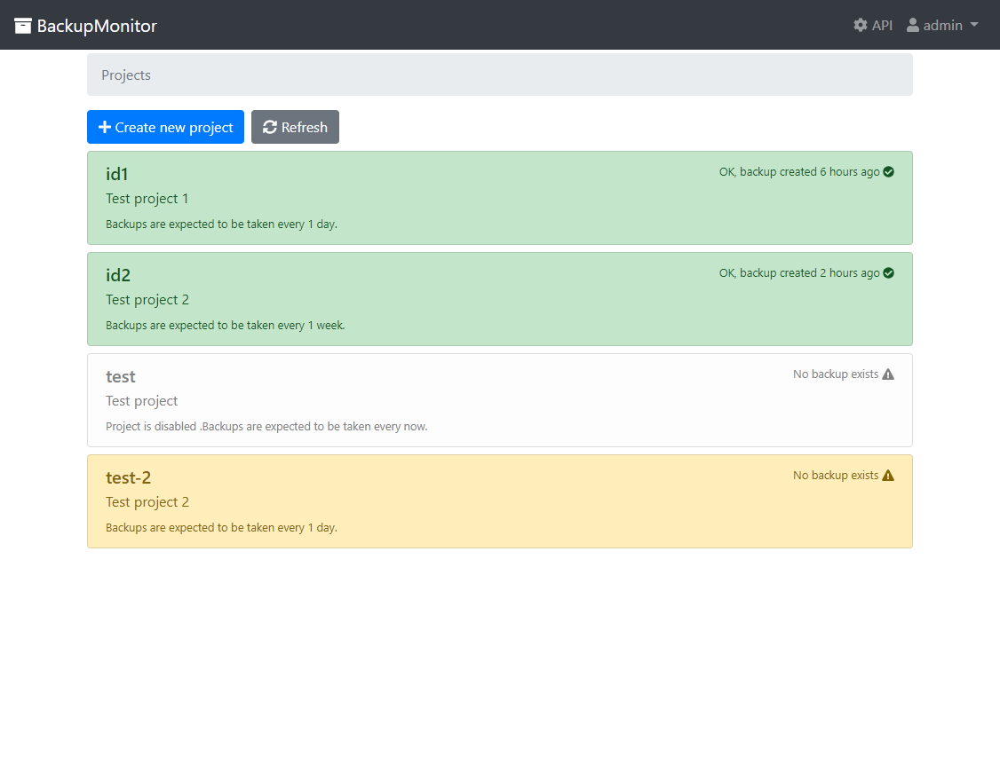

# Backup Monitor

Small server-side app that serves a simple purpose:
to receive, manage and monitor various backups.



* [Features](#features)
* [Installation](#installation)
* [Configuration](#configuration)
  * [Use file system as backup storage](#use-file-system-as-backup-storage)
  * [Use AWS S3 service as backup storage](#use-aws-s3-service-as-backup-storage)
  * [Use custom S3-compatible service as backup storage](#use-custom-s3-compatible-service-as-backup-storage)
* [How to upload backups](#how-to-upload-backups)
* [How to receive notifications if backups are out of date](#how-to-receive-notifications-if-backups-are-out-of-date)
  * [Receive notifications via Slack](#receive-notifications-via-slack)
  * [Receive notifications via Telegram](#receive-notifications-via-telegram)
  * [Receive notifications via webhooks](#receive-notifications-via-webhooks)
* [Local development](#local-development)
* [License](#license)

## Features

* App teceives a generic backup files via HTTP(S)
* App stores backups either on local filesystem or on any S3-compatible service
* App keeps at least N last backups for each target
* App notifies your team via Slack/Telegram/Webhooks if something goes wrong

## Installation

1. Clone git repository:

   ```shell
   git clone https://github.com/itglobal/backupmonitor.git
   cd backupmonitor
   ```

2. Create `.env` file and configure it (see [section](#configuration) below).

   At least you'll need to set two variables in `.env` file:

   * `DOMAIN=your.domain.name.com` - domain name for **BackupManager** instance.
   * `JWT_KEY=any-random-string` - encryption key for JWT tokens
     (try `openssl rand -base64 32` to generate one).

   All other parameters are optional.

3. Build and start docker containers:

   ```shell
   docker-compose up -d
   ```

## Configuration

**BackupMonitor** is configured via environment variables:

| Variable         | Value type | Default value              | Description                             |
| ---------------- | ---------- | -------------------------- | --------------------------------------- |
| `VAR`            | string     | `$(pwd)/var`               | Path to data directory                  |
| `LISTEN_ADDR`    | string     | `0.0.0.0:8000`             | HTTP endpoint to listen                 |
| `JWT_KEY`        | string     | `test`                     | Encryption key for JWT tokens           |
| `S3_BUCKET`      | string     |                            | S3 bucket name                          |
| `S3_ACCESS_KEY`  | string     |                            | S3 access key                           |
| `S3_SECRET_KEY`  | string     |                            | S3 secret key                           |
| `S3_DOMAIN`      | string     | `https://s3.amazonaws.com` | Custom domain for S3                    |
| `SLACK_TOKEN`    | string     |                            | Slack access token                      |
| `SLACK_USERNAME` | string     |                            | Custom username for Slack notifications |
| `TELEGRAM_TOKEN` | string     |                            | Telegram access token                   |

### Use file system as backup storage

File system storage is enabled by default. Backup files will be stored in `$VAR/blob/` directory.

### Use AWS S3 service as backup storage

In order to enable AWS S3 storage you will need to set following variables:

* `S3_BUCKET` - AWS S3 bucket name
* `S3_ACCESS_KEY` - AWS S3 access key
* `S3_SECRET_KEY` - AWS S3 secret key
* `S3_DOMAIN` - must be empty or non set

Note that if credentials aren't valid, **BackupManager** won't start.

### Use custom S3-compatible service as backup storage

In order to enable custom S3-compatible storage you will need to set following variables:

* `S3_BUCKET` - S3 service bucket name
* `S3_ACCESS_KEY` - S3 service access key
* `S3_SECRET_KEY` - S3 service secret key
* `S3_DOMAIN` - S3 service URL. You may specify:
  
  * either an absolute URL, e.g. `http://foo.bar.com` or `https://secure-foo.bar.com`
  * or a domain name with port, e.g. `foo.bar.com:8000`
    (app will assume it's an HTTP endpoint, not an HTTPS one)

Note that if credentials aren't valid, **BackupManager** won't start.

## How to upload backups

1. Create a project for backups.
   Project is basically a container for backup with history and status tracking.
2. Configure project parameters:

   * Set backup frequency (e.g. `1 day` - this means that backups should be taken at least once a day)
   * Set backup retention (e.g. `10` - this means that **BackupMonitor** will keep 10 last backups)
   * Configure stale backup notifications.

3. Create an access key for a project.
4. Write a backup script:

   ```bash
   #!/usr/bin/env bash
   set -e

   # Configure script
   BACKUP_FILE="/tmp/my-backip-file"
   ENDPOINT="https://my-backup-server.company.com"
   ACCESS_KEY="your-access-key"

   # TODO Take backup and write it into $BACKUP_FILE
   echo "Replace this with actual backup command" > $BACKUP_FILE

   # Upload backup
   curl -X POST "$ENDPOINT/api/backup" -H "Authorization: $ACCESS_KEY" -F "file=@$BACKUP_FILE"

   # Drop local backup file
   rm $BACKUP_FILE
   ```

5. Run your script once to make sure it works.
6. Configure your script to run on a schedule.

## How to receive notifications if backups are out of date

There are 3 ways to receive notifications:

* receive messages via Slack (either direct messages or messages to group/channel)
* receive messages via Telegram (only messages to group are supported)
* receive custom HTTP webhooks

**BackupManager** will detect if project backups are out of date and send notifications every 8 hours.

### Receive notifications via Slack

In order to enable Slack notifications you will need to set following variables:

* `SLACK_TOKEN` - Slack access token
* `SLACK_USERNAME` - custom username for Slack notifications (this parameter is optional)

If a correct access token is set, **BackupManager** will send notifications
to configured Slack channels or users.

Note that you will need to configure notifications for a particular project.

Use `@username` to send notifications via direct messages and
`#channel` to send notifications into a channel or a group.

### Receive notifications via Telegram

In order to enable Telegram notifications you will need to set following variables:

* `TELEGRAM_TOKEN` - Telegram bot access token

If a correct access token is set, **BackupManager** will send notifications
to configured Telegram groups.

Note that you will need to configure notifications for a particular project.

Due to Telegram API limitations you'll have to:

* create a bot access token via [BotFather](https://t.me/BotFather)
* create a private group for notifications
* add your bot into group
* find out group's numeric ID
* use that ID to configure project notification

### Receive notifications via webhooks

You may specify an URL to receive webhook events from **BackupManager** if backups are out of date.

**BackupManager** will make POST requests to specified URL with the following JSON payload:

```json
{
   "project" : "PROJECT_ID",
   "lastBackupTime" : "2020-01-01T12:00:00Z"
}
```

## Local development

There are two options for local development:

* using directory as a storage - by default app will store all files in `./var/blob/` directory.

* using local Minio as a storage:

  1. Run the following command to setup local minio instance (dockerized):

     ```shell
     ./scripts/setup-local-env
     ```

  2. Create file `.env` with the following content (it won't be commited into git):

     ```shell
     S3_BUCKET=backupmanager
     S3_ACCESS_KEY=developer
     S3_SECRET_KEY=developer
     S3_DOMAIN=http://localhost:9000
     ```

## License

[MIT](LICENSE)
